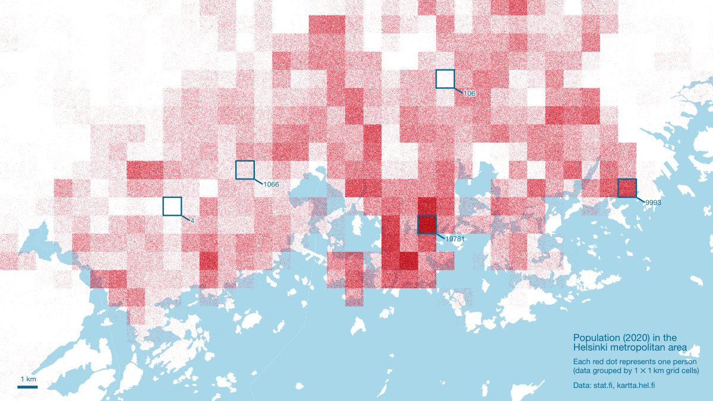

# #30DayMapChallenge

This repository contains the source code and accompanying files for (some of) the maps submitted by the Digital Geography Lab to [@tjukanovt](https://github.com/tjukanovt)’s [*30 Day Map Challenge*](https://github.com/tjukanovt/30DayMapChallenge).

This repository is going to fill with beautiful maps over the course of November 2021.

## 1 November 2021: points

- Tools: [QGIS](https://qgis.org)
- Data: [Statistics Finland](https://stat.fi/org/avoindata/paikkatietoaineistot_en.html), [City of Helsinki](https://kartta.hel.fi/avoindata)/[Helsinki Region Infoshare](https://hri.fi/data/fi/dataset/seutukartta).

## 2 November 2021: lines

- Tools: [QGIS](https://qgis.org)
- Data: [Global River Database](http://gaia.geosci.unc.edu/rivers/)

## 3 November 2021: polygons

- Tools: [QGIS](https://qgis.org)
- Data: [SYKE/avoindata.fi](https://www.avoindata.fi/data/en_GB/dataset/ymparistomeludirektiivin-mukaiset-melualueet-2017)

## 4 November 2021: hexagons

- Tools: [QGIS](https://qgis.org/), [PostgreSQL/PostGIS](https://postgis.net/), [Inkscape](https://inkscape.org/)
- Data: collected from eBird, OLX, and YouTube; available from the authors upon request.
- Published in Fink, C., Toivonen, T., Correia, R. A., & Di Minin, E. (2021). Mapping the online songbird trade in Indonesia. Applied Geography 134. [DOI: 10.1016/j.apgeog.2021.102505](https://doi.org/10.1016/j.apgeog.2021.102505)

