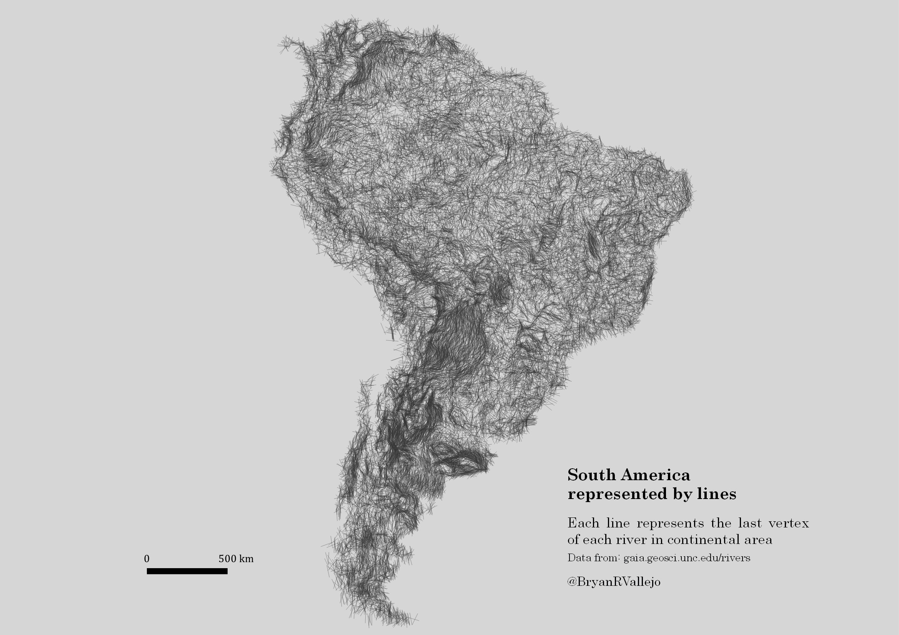

# #30DayMapChallenge

This repository contains the source code and accompanying files for (some of) the maps submitted by the Digital Geography Lab to [@tjukanovt](https://github.com/tjukanovt)’s [*30 Day Map Challenge*](https://github.com/tjukanovt/30DayMapChallenge).

This repository is going to fill with beautiful maps over the course of November 2021.

## 1 November 2021: points

- Tools: [QGIS](https://qgis.org)
- Data: [Statistics Finland](https://stat.fi/org/avoindata/paikkatietoaineistot_en.html), [City of Helsinki](https://kartta.hel.fi/avoindata)/[Helsinki Region Infoshare](https://hri.fi/data/fi/dataset/seutukartta).

## 2 November 2021: lines

- Tools: [QGIS](https://qgis.org)
- Data: [Global River Database](http://gaia.geosci.unc.edu/rivers/)
