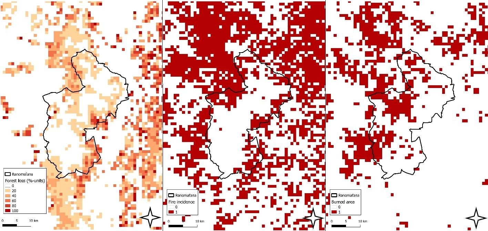

# #30DayMapChallenge

This repository contains the source code and accompanying files for (some of) the maps submitted by the Digital Geography Lab to [@tjukanovt](https://github.com/tjukanovt)’s [*30 Day Map Challenge*](https://github.com/tjukanovt/30DayMapChallenge).

This repository is going to fill with beautiful maps over the course of November 2021.

## 1 November 2021: points

- Map: Christoph Fink
- Tools: [QGIS](https://qgis.org)
- Data: [Statistics Finland](https://stat.fi/org/avoindata/paikkatietoaineistot_en.html), [City of Helsinki](https://kartta.hel.fi/avoindata)/[Helsinki Region Infoshare](https://hri.fi/data/fi/dataset/seutukartta).

Like or retweet this map on Twitter: [https://twitter.com/digigeolab/status/1455068433012375555](https://twitter.com/digigeolab/status/1455068433012375555)

## 2 November 2021: lines

- Map: Bryan R. Vallejo
- Tools: [QGIS](https://qgis.org)
- Data: [Global River Database](http://gaia.geosci.unc.edu/rivers/)

Like or retweet this map on Twitter: [https://twitter.com/digigeolab/status/1455425016963780616](https://twitter.com/digigeolab/status/1455425016963780616)

## 3 November 2021: polygons

- Map: Elias Willberg
- Tools: [QGIS](https://qgis.org)
- Data: [SYKE/avoindata.fi](https://www.avoindata.fi/data/en_GB/dataset/ymparistomeludirektiivin-mukaiset-melualueet-2017)

Like or retweet this map on Twitter: [https://twitter.com/digigeolab/status/1455801714108510212](https://twitter.com/digigeolab/status/1455801714108510212)

## 4 November 2021: hexagons

- Map: Christoph Fink
- Tools: [QGIS](https://qgis.org/), [PostgreSQL/PostGIS](https://postgis.net/), [Inkscape](https://inkscape.org/)
- Data: collected from eBird, OLX, and YouTube; available from the authors upon request.
- Published in Fink, C., Toivonen, T., Correia, R. A., & Di Minin, E. (2021). Mapping the online songbird trade in Indonesia. Applied Geography 134. [DOI: 10.1016/j.apgeog.2021.102505](https://doi.org/10.1016/j.apgeog.2021.102505)

Like or retweet this map on Twitter: [https://twitter.com/digigeolab/status/1456160322188980228](https://twitter.com/digigeolab/status/1456160322188980228)

## 5 November 2021: data challenge OpenStreetMap

- Map: Tatu Leppämäki
- Tools: [QGIS](https://qgis.org/), [pyrosm](https://github.com/HTenkanen/pyrosm/), [momepy](https://github.com/pysal/momepy/)
- Data: [OpenStreetmap](https://osm.org/)

Like or retweet this map on Twitter: [https://twitter.com/digigeolab/status/1456515961763270724](https://twitter.com/digigeolab/status/1456515961763270724)

## 6 November 2021: red

- Map: Christoph Fink
- Tools: [QGIS](https://qgis.org/), [Inkscape](https://inkscape.org/)
- Data: [IUCN Red List](https://www.iucnredlist.org/resources/spatial-data-download), [Natural Earth Data](https://naturalearthdata.com/)

Like or retweet this map on Twitter: [https://twitter.com/digigeolab/status/1456916293190397956](https://twitter.com/digigeolab/status/1456916293190397956)

## 7 November 2021: green

- Map: Elias Willberg
- Tools: [QGIS](https://qgis.org/), [GIMP](https://gimp.org/)
- Data: [Toikka et al., 2020](https://doi.org/10.1016/j.dib.2020.105601), [Helsinki Region Infoshare](https://hri.fi/data/fi/dataset/seutukartta)

Like or retweet this map on Twitter: [https://twitter.com/digigeolab/status/1457266694964002817](https://twitter.com/digigeolab/status/1457266694964002817)

## 8 November 2021: blue

- Map: Bryan R. Vallejo
- Data: [Andreadis et al., 2013](https://doi.org/10.1002/wrcr.20440)

Like or retweet this map on Twitter: [https://twitter.com/digigeolab/status/1457603681537376259](https://twitter.com/digigeolab/status/1457603681537376259)

## 9 November 2021: monochrome

- Map: Johanna Eklund
- Data: [Protected Planet](https://www.protectedplanet.net/)
- Tools: [QGIS](https://qgis.org/)

Like or retweet this map on Twitter: [https://twitter.com/digigeolab/status/1457972640778444800](https://twitter.com/digigeolab/status/1457972640778444800)

## 10 November 2021: raster

- Map: Saija Papunen
- Data: [Ghislain Vieilledent](https://ecology.ghislainv.fr/), [MODIS](https://modis.gsfc.nasa.gov/)

Like or retweet this map on Twitter: [https://twitter.com/digigeolab/status/1458359121766408193](https://twitter.com/digigeolab/status/1458359121766408193)

## 11 November 2021: 3D

- Map: Brian R. Vallejo
- Tools: [pandas](https://pandas.org/), [geopandas](https://geopandas.org), [KeplerGL](https://kepler.gl), [mapbox](https://mapbox.com/)
- Data: [HSL](https://www.hsl.fi/en/hsl/open-data#journeys-made-by-city-bikes), [OpenStreetMap contributors](https://www.openstreetmap.org/copyright)

Like or retweet this map on Twitter: [https://twitter.com/digigeolab/status/1458725195800367109](https://twitter.com/digigeolab/status/1458725195800367109)